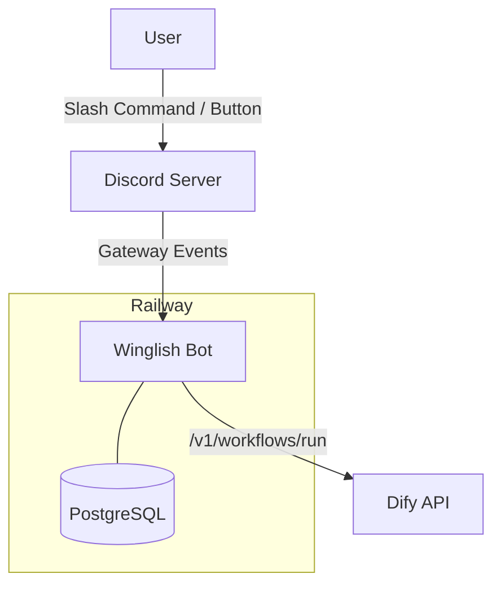

# Winglish Discord Bot

> 🧠 **Winglish Discord Bot** は、英語学習サービス「[Winglish](https://winglish.site/)」を Discord 上で展開するために開発された学習支援Botです。  
> 英単語・英文解釈（SVOCM）・長文読解の3機能を通じて、チャット感覚で学習が進められます。

---

## プロジェクト概要

このBotはもともと、ノーコードツール **Bubble** 上で構築されていた「Winglish」を、  
Discord 環境でも利用できるように再設計したものです。

- **対象**：高校生〜大学生の英語学習者  
- **目的**：インプット型学習を脱して、チャットベースのアウトプット型英語学習を実現  
- **構成要素**
  - Discord Bot（`main.py` / `cogs/*`）
  - PostgreSQL（Railway上で運用）
  - Dify API（出題・採点処理）

---

## セットアップ手順

### 1. 環境準備

- **Python 3.12 以上**
- **Git / Railway / Discord Developer Portal アカウント**
- 任意：VSCode + Poetry or venv

```bash
git clone https://github.com/<yourname>/Winglish-bot.git
cd Winglish-bot
python -m venv .venv
# Windows
.venv\Scripts\activate
# macOS/Linux
source .venv/bin/activate
pip install -r requirements.txt
```

---

### 2. `.env` 設定

```dotenv
# Discord
DISCORD_TOKEN=あなたのBotトークン
TEST_GUILD_ID=テスト用サーバーID

# Database
DATABASE_PUBLIC_URL=
PGHOST=
PGPORT=
PGUSER=
PGPASSWORD=
PGDATABASE=

# Data
WORDS_CSV_PATH=data/All-words-modified_2025-10-29_08-31-22.csv

# Dify
DIFY_API_KEY_QUESTION=
DIFY_API_KEY_ANSWER=
DIFY_ENDPOINT_RUN=https://api.dify.ai/v1/workflows/run
```

> 🔒 **セキュリティ注意**  
> BotトークンやAPIキーは `.env` と Railway Secrets のみに保存し、GitHubには絶対に公開しないでください。  
> 公開リポジトリをそのまま利用する場合も、**各自の新しいBotを作成して運用**してください。

---

### 3. データベース初期化

```bash
python apply_schema.py
python scripts/load_words.py
```

- `apply_schema.py`：`sql/schema.sql` を適用  
- `load_words.py`：CSVから単語データを投入  

---

### 4. Botを起動（ローカル）

```bash
python main.py
```

Botが起動し、Discord 上に「Winglish」メニューが表示されればOKです。

---

### 5. Railwayデプロイ（任意）

1. Railwayで新しいプロジェクトを作成  
2. PostgreSQLアドオンを追加  
3. Secrets に `.env` の値を登録  
4. Deploy コマンド：  
   ```
   python main.py
   ```
5. Logs で `✅ Cog 読み込み完了` が出ればデプロイ成功

---

## コマンド例

| 機能 | コマンド / 操作 | 説明 |
|------|------------------|------|
| メニュー表示 | `/winglish menu` | 英単語・SVOCM・長文読解のメインメニューを表示 |
| 英単語 | 「英単語」ボタン | 10問テストを開始（SRS対応） |
| 英文解釈 | 「SVOCM」ボタン | 文型入力モーダルが開く |
| 長文読解 | 「長文読解」ボタン | 1問の長文を生成→4択×2設問を出題 |
| 管理 | `/winglish reset / attach_menu / ping` | 管理用コマンド |

---

## 構成図（概要）



---

## 注意事項 / 開発方針

- **新しいBotを作成してください。**  
  このリポジトリのBotトークンは使用禁止です。各自の環境で新規登録して運用してください。
- **リポジトリのforkやPRは想定していません。**  
  コードを参考に個人環境で開発・改善してください。
- **既知の問題**
  - 鍵チャンネル作成時にユーザーネームが取得できないことがある  
  - 一部メッセージ遷移（英単語終了後など）に不安定な挙動あり  

---

## 🌟 開発者メモ

- 作者：國政 蒼矢（Tokyo International Professional University of Technology）  
- 環境：Windows 11 / Python 3.12 / Railway  
